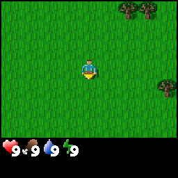
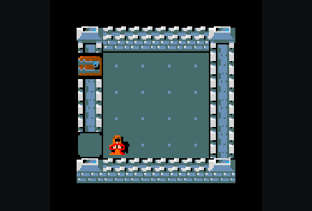
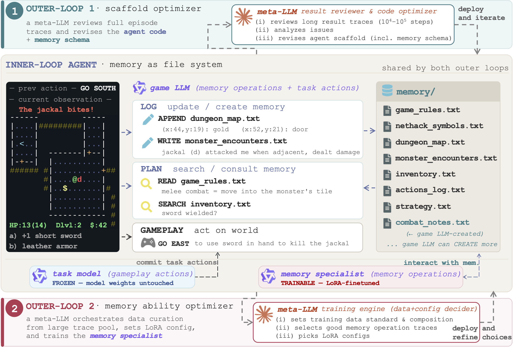

<div align="center">
<h1>AutoMem:<br>Automated Learning of Memory as a Cognitive Skill</h1>

[](https://autolearnmem.github.io/)
[](https://arxiv.org/abs/2607.01224)
[](https://huggingface.co/papers/2607.01224)
[](https://x.com/ShengguangWu/status/2073083010631795083)

</div>

---

**AutoMem** treats **memory management as a trainable skill** for LLM agents.
File-system operations are promoted to **first-class memory actions** that live in the same action space as the agent's task actions — so the model itself decides what to record, when to retrieve it, and how to organize what it knows.
A strong **meta-LLM** then improves this skill along two axes by reviewing complete episode traces: the **structure** that supports it (Loop 1, scaffold optimization) and the model's **proficiency** at using it (Loop 2, memory-proficiency training).
Optimizing memory alone — without touching the model's task-action behavior — brings an open-weight `Qwen2.5-32B-Instruct` competitive with frontier systems on three long-horizon games: **Crafter**, **MiniHack**, and **NetHack**.

<table width="100%">
<tr>
<td width="19%" align="center"></td>
<td width="26%" align="center"></td>
<td width="55%" align="center"></td>
</tr>
<tr>
<td align="center"><sub><b>Crafter</b> — 13/22 crafting achievements unlocked (progression: 59%)</sub></td>
<td align="center"><sub><b>MiniHack</b> — threads the branching corridors to goal staircase (progression: 100%)</sub></td>
<td align="center"><sub><b>NetHack</b> — descends to dungeon level (Dlvl) 2 and reaches experience (Xp) level 5 (progression: 2.91%)</sub></td>
</tr>
</table>


## 🧠 How it works

<p align="center">

</p>

At each step the inner-loop agent runs two routines over a directory of memory files:
**LOG** — records what just happened; **PLAN** — consults memory files before committing the next game action.

Two outer loops, both driven by a meta-LLM that reads full episode traces, improve this agent:

- **Loop 1 — scaffold optimization (*structure*).** The meta-LLM diagnoses where memory use went wrong and rewrites the agent scaffold (code, prompts, memory-file schema, action vocabulary). A revision is kept only if average task progression improves on a fixed seed set.

- **Loop 2 — memory-proficiency training (*proficiency*).** A meta-LLM *training engine* selects supervised examples from the base model's own traces and jointly chooses the data composition and the LoRA configuration, training a dedicated **memory specialist**. At inference, the finetuned **memory specialist** handles LOG and the memory-consultation part of PLAN, while the **unmodified base model** commits the world action.


## 🚀 Setup

We recommend two conda environments — one for **evaluation** in the task environments and one for **loop-2 LoRA training** — plus the **Claude Code CLI** that drives the meta-LLM. 

Choose any names and set them in `loop1_scaffold_evolution/run_scaffold_opt.sh` and `loop2_training_engine/run_training_engine.sh` via `EVAL_CONDA_ENV` / `TRAIN_CONDA_ENV` — e.g., `balrog` (eval) and `llamafactory` (training).

### Evaluation environment

AutoMem evaluates inside the [BALROG](https://github.com/balrog-ai/BALROG) benchmark harness, which provides the Crafter, MiniHack, and NetHack (NLE) environments. Clone BALROG and follow its install guide. 

### Training environment

Loop-2 LoRA finetuning uses [LLaMA-Factory](https://github.com/hiyouga/LLaMA-Factory). Clone and install it per its install guide, then point AutoMem at it:

```bash
export LLAMA_FACTORY_DIR=/path/to/LLaMA-Factory
```

### Meta-LLM (Claude Code CLI)

Both outer loops shell out to a strong meta-LLM via the [`claude`](https://claude.com/claude-code) command-line tool (`claude -p ...`). Install Claude Code and make sure the `claude` binary is on your `PATH`. The inner-loop agent itself does **not** need Claude Code — only the two meta-loops do.


## 🔬 Running

### Evaluate an agent in a scaffold

Each scaffold under `scaffolds/` is a self-contained agent. Serve the base model with vLLM and run the scaffold's `eval.py`:

```bash
conda activate balrog
vllm serve Qwen/Qwen2.5-32B-Instruct --port 2026 --served-model-name Qwen/Qwen2.5-32B-Instruct

cd scaffolds/inner_agent_v0
python eval.py \
    agent.type=memory \
    envs.names=crafter \
    eval.run_name=crafter_v0_eval \
    agent.memory_dir=memory/crafter_v0_eval \
    "eval.seeds=[42,43,44,45,46,47,48,49,50,51]" \
    eval.num_episodes.crafter=10 \
    eval.num_workers=10 \
    client.client_name=vllm \
    client.model_id=Qwen/Qwen2.5-32B-Instruct \
    client.base_url=http://0.0.0.0:2026/v1
```

The v0 starting agent (`scaffolds/inner_agent_v0`) and the final per-env scaffolds (`crafter_v5`, `minihack_v4`, `nethack_v2`) run the same way; their `_twomodel` siblings evaluate a trained memory specialist alongside the base gameplay model (see [Loop 2](#loop-2--memory-proficiency-training) below).


> The `crafter_v5` / `minihack_v4` / `nethack_v2` scaffolds are **our** evolved results, shipped for reference — you are not limited to them: With Loop 1 you can evolve your own scaffold starting from `inner_agent_v0`, or from any agent you design.

### Loop 1 — scaffold optimization

```bash
bash loop1_scaffold_evolution/run_scaffold_opt.sh
```

Starting from `scaffolds/inner_agent_v0` (or any agent codebase of your own), each iteration the meta-LLM (`meta_loop.py`) reads the previous scaffold's eval traces and writes a revised scaffold under `output/.../revised_code/`. The launch script then applies the revision to a fresh codebase copy, evaluates it against the vLLM-served base model, and re-points the wrapper for the next iteration.

### Loop 2 — memory-proficiency training

```bash
bash loop2_training_engine/run_training_engine.sh
```

One training recipe runs end to end: (1) the **data engine** (`data_engine.py`) reads base-model traces and selects verbatim LOG/PLAN turns whose memory operations are worth reinforcing; (2) a deterministic post-processing step strips unwanted formatting artifacts from the selected traces; (3) **LoRA SFT** trains the base model into a memory specialist; (4) the two-model eval serves the memory specialist alongside the untrained base gameplay model and runs the matching `_twomodel` scaffold. 

The meta-LLM then autonomously refines the data-selection logic (manifested in the data engine) and chooses a matching LoRA configuration for the next recipe. Optionally set `BASELINE_METRIC` in `run_training_engine.sh` to your Loop-1 scaffold-only progression (the no-training baseline), or leave it empty and the engine treats it as `unknown`.

> We ship a **starting** `data_engine.py` (the selector the training engine begins from) and, per environment, a `config_recommendation.md` (a prior the engine may use or ignore). With Loop 2, the training engine evolves the `(data engine, LoRA config)` recipe from there toward the pair that works best on your setup.


## 📂 Repository layout

```
scaffolds/
  inner_agent_v0/             the v0 memory-as-filesystem agent (loop-1 starting point)
  crafter_v5/  crafter_v5_twomodel/     (our evolved scaffolds + their two-model version for loop 2)
  minihack_v4/ minihack_v4_twomodel/
  nethack_v2/  nethack_v2_twomodel/
loop1_scaffold_evolution/
  meta_loop.py                the scaffold-optimizing meta-LLM loop
  run_scaffold_opt.sh         launch wrapper
loop2_training_engine/
  training_engine.py          the meta-LLM training-engine (one recipe per iteration)
  data_engine.py              the starting memory-data selector
  postprocess.py              deterministic post-processing
  ledger.py                   result ledger builder
  run_training_engine.sh      launch wrapper
  env/<env>/
    config_recommendation.md  recommended LoRA config for that env (prior)
assets/                       figures used in this README
```

## Citation

If you find AutoMem useful, please consider citing our paper:

```bibtex
@article{wu2026automem,
  title={AutoMem: Automated Learning of Memory as a Cognitive Skill},
  author={Wu, Shengguang and Zhu, Hao and Zhang, Yuhui and Wang, Xiaohan and Yeung-Levy, Serena},
  journal={arXiv preprint arXiv:2607.01224},
  year= {2026}
}
```

## Acknowledgments

AutoMem builds on several open-source projects, and use of the corresponding components is subject to their respective licenses. We thank the authors of: [BALROG](https://github.com/balrog-ai/BALROG) (the benchmark harness), the [NetHack Learning Environment](https://github.com/NetHack-LE/nle) (NLE), [MiniHack](https://github.com/facebookresearch/minihack), [Crafter](https://github.com/danijar/crafter), and [LLaMA-Factory](https://github.com/hiyouga/LLaMA-Factory) (LoRA training). The base model is [Qwen2.5-32B-Instruct](https://huggingface.co/Qwen/Qwen2.5-32B-Instruct), and the meta-LLM driving both outer loops is invoked via the [Claude Code](https://claude.com/claude-code) CLI.
